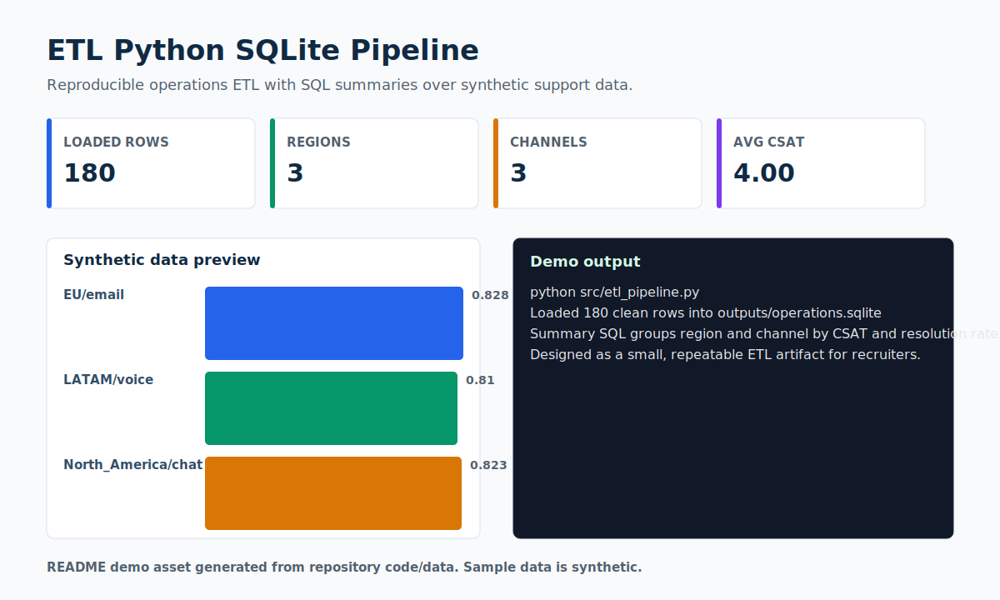

# ETL Python SQLite Pipeline

> A reproducible Python-to-SQLite pipeline for synthetic support-operations data.



## Recruiter Snapshot

| 30-second question | Answer |
| --- | --- |
| Problem | Operational reports are only useful after records are deduplicated, typed, validated, loaded, and made queryable. |
| My role | I built the extract-transform-load flow, added SQL summaries, and documented it as a reviewer-friendly portfolio artifact. |
| Result | The script loads 180 clean synthetic rows into SQLite and prints CSAT plus resolution-rate summaries by region/channel. |
| Portfolio signal | Shows data engineering basics that complement WFM/RTA experience: clean data in, queryable operations insight out. |
| Data policy | All records are synthetic and safe for a public portfolio. |

## What I Built

- CSV extraction from a synthetic operations batch.
- Deduplication, type coercion, basic validation, and derived resolution rate.
- SQLite output plus reusable SQL queries.

## Evidence In This Repo

- `src/etl_pipeline.py` runs the pipeline end to end.
- `src/queries.sql` documents the SQL review queries.
- `data/sample_synthetic_data.csv` provides 180 public-safe rows.

## Tools And Concepts

`Python`, `pandas`, `SQLite`, `SQL`, `ETL`, `operations analytics`

## Run Locally

```bash
python -m venv .venv
.venv\Scripts\activate
python -m pip install -r requirements.txt
python src/etl_pipeline.py
```

## Limitations

The pipeline is local and deterministic. It does not include orchestration, lineage, access control, or production observability.

## Next Iteration

- Add pytest coverage for transform rules.
- Add schema checks for expected columns and ranges.
- Add an optional dashboard over the SQLite output.

## Data Privacy

Every record, identifier, organization, person, scenario, and result in this project is synthetic unless explicitly marked otherwise. No employer, client, university, colleague, customer, credential, private path, or sensitive personal record is used.
